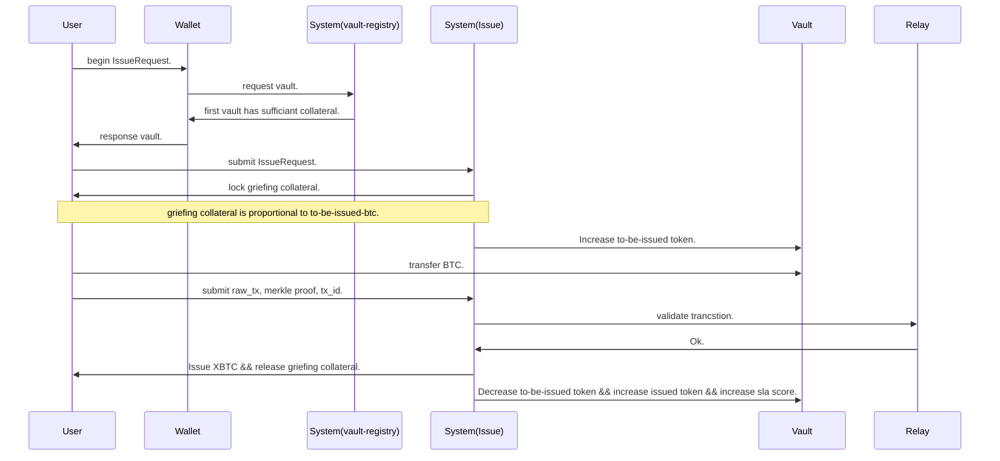

# 概述

CXBridge用于BTC的跨链充值和提现。账户在其中分为三种角色： 用户，资产保险库和监察者。
- 用户：发起充值，提现请求。
- 资产保险库：处理用户的请求，保管用户充值进来的BTC。

资产保险库是区别于1.0中信托多签模式的去中心化托管方案。资产保险库需要抵押一笔PCX为其信用背书，一般情况下，资产保险库的抵押资产高于
账户名下保管的BTC的资产。
::: tip
PCX与BTC的汇率由`exchange-rate-oracle`模块确定，见[汇率](exchange-rate#设置汇率)章节。
:::

一次简单的充值行为的流程如下：

资产保险库的地址收到约束，当发生除了提现和合并请求之外的变动时，会强制清算该资产保险库。敏感交易的搜集上报目前由btc-relay完成。

## 模块

### [资产保险库](vault)
资产保险库的注册，增加抵押物，合并。

### [充值与赎回](IssueAndRedeem)
用户用BTC进行充值和赎回BTC

  ##### [汇率](exchange-rate)
  - [ ] 定期上报PCX-BTC的汇率变动。

  ##### [fee](fee)
  - [ ] 手续费管理，惩罚费用管理。

