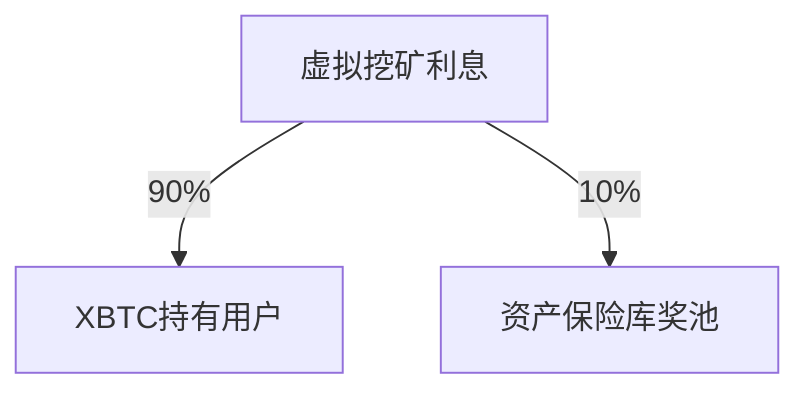

# CXBridge文档

## 概述
/*why we need it*/
CXBridge用于BTC的跨链充值和提现, 并作为一个功能模块集成在ChainX中。用户可以通过它自由在btc和chainx之间转移资产，通过XBTC进行资产挖矿获得收益，或者以更低的手续费和时延进行BTC的交易。对比1.0的信托方式，2.0通过资产保险库的形式进行资产管理，并通过抵押品的方式进行风险控制。

/*what it does*/
CXBridge中存在三种角色： 普通用户（下文称用户），资产保险库和监察者。

任意用户可以通过锁定PCX作为抵押品申请成为资产保险库。而每个资产保险库会绑定一个相关联的比特币地址， 其他用户可以通过匹配的资产保险库的地址转账来获得相应的XBTC。反过来， 用户也可以通过销毁XBTC
来获得扣除手续费之后的相应比特币。

每个资产保险库所关联的地址是收到监管的，当发现有异常交易的时候，CXBridge会强制[清算](#清算)该资产保险库。


TODO(wangyafei): Get start for user, for vault.
TODO(wangyafei): Api reference.

资产保险库是区别于1.0中信托多签模式的去中心化托管方案。资产保险库需要抵押一笔PCX为其信用背书，一般情况下，资产保险库的抵押资产高于
账户名下保管的BTC的资产。

## 快速上手

### 例子

一次简单的充值行为的流程如下：

资产保险库的地址收到约束，当发生除了提现和合并请求之外的变动时，会强制清算该资产保险库。敏感交易的搜集上报目前由btc-relay完成。

## Api文档

### 资产管理
这部分API主要处理:
- 集中管理抵押物和X-BTC，允许锁定抵押物，解锁抵押物和惩罚用户或者资产保险库。
- 提供抵押物(PCX)和X-BTC的汇率的更新，设置汇率提供者。
- CXBridge的状态管理


#### 抵押物处理
##### 锁定抵押物
在以下情况时需要锁定抵押物：
- 用户申请注册成为资产保险库时
- 资产保险库需要增加抵押物时
- 用户发起充值申请时

###### 第一、二种情况
注册成为资产保险库的时候， 抵押物需要高于最小抵押额度， 其他时候数额任意

###### 第二种情况
用户发起充值申请时，抵押物的数额和待充值金额正相关， 其比例在`GenesisConfig`中给出， 目前默认为`10%`， 正常情况下在充值成功后， 将返还给用户， 如果用户在一定的区块间隔中未及时转账， 那么这笔抵押物
将赔偿给资产保险库。


::: tip
用户发起充值申请成功后， 会临时降低资产保险库的抵押率， 如果用户长时间未处理充值请求，并恶意发起多起充值，则资产保险库将无法正常工作，因此需要用户在充值的时候临时抵押一笔资金，如果用户处理充值请求超时，这笔资金将转给资产保险库。
:::

##### 解锁抵押物
在以下情况时需要解锁抵押物：
- 资产保险库主动申请解锁抵押物时
- 用户充值成功时


### 资产保险库
模块负责资产保险库的注册，增加抵押品，提现抵押品。目前尚不支持注销。
资产保险库用于保管用户充值进来的BTC。每个资产保险库在注册的时候需要质押一笔PCX，
质押的PCX的多寡决定了该资产保险库最多可发行的代币。

#### 资产保险库的收益
资产保险库的收益主要来源于虚拟挖矿。通过该资产保险库所发行的代币所得的挖矿利息
会按一定比例分给该资产保险库。比例的计算公式为
$$分红率 =（抵押率 - 清算阈值） / （安全阈值 - 清算阈值）* 最大分红比例$$
最大分红比例为常数， 目前暂定10%。
不足10%的部分，按照每个保险库的抵押品比率分给各保险库。分红逻辑如下：


每次挖矿周期中，每个保险库能得到的收益为
$$分红率 * 每XBTC收益 * 发行代币量 + 奖池剩余金额 * (抵押品/总抵押品)$$

#### 资产保险库的作用
资产保险库作为BTC和ChainX的中转，会处理来自于用户的充值与提现请求，具体内容在[充值与提现](../IssueAndRedeem)一章中。
充值与提现都将通过BTC-relay进行校验，对交易信息中的op_return来确认账户身份。资产保险库的充值与交易请求并没有对应关系，
即通过某个资产保险库充值的X-BTC并不需要通过同一保险库提现。资产保险库需要尽量保证自己的抵押品充足，在抵押率低的时候，不仅收益会降低，甚至受到一定的惩罚。
  
每次出块之前，抵押率低于清算阈值的保险库将被清算，所持有的代币量及抵押品将转入清算账户。

#### 存储

##### VaultMinimumCollateral  
  注册成为资产保险库的PCX最小抵押数量，低于此数量的的保险库将无法注册。这是为了防止注册接口被滥用。
##### PunishmentDelay  
  资产保险库惩罚时间。如果超时未处理提现请求， 那么该保险库在一段时间内被禁用。被禁用的保险库，无法接受新的充值或者提现请求。但可以处理现有的交易，
  被惩罚金额等于提现金额等价的pcx。
##### SecureCollateralThreshold  
  资产保险库抵押率的安全阈值，高于此阈值的保险库，可以享受最大的分红比例。
##### PremiumRedeemThreshold  
  资产保险库需要超额赎回的阈值，如果保险库的抵押率低于此阈值，在处理提现请求时，将额外支付等价于提现金额10%的pcx。
##### LiquidationCollateralThreshold
  资产保险库被清算的阈值，每个块初始化之前会确认每个保险库是否为清算状态。
##### LiquidationVaultAccountId  
  Wrapper
##### LiquidationVault  
  在genesis中声明的账户，当资产保险库被清算时，他的X-BTC和抵押的PCX将被转移到此账户。
  ::: details Question
  多名Vault被清算会使所有被清算的资产保险库的数据合并到此账户下。包括已发行的代币，抵押物，待发行代币和待体现代币。
  :::
##### Vaults  
  资产保险库的列表。
##### VaultBtcAdresses  
  资产保险库的BTC地址， 地址需要唯一
##### Version  
  版本号

#### 交易

##### 注册

注册成为资产保险库， 申请人必须是一个节点， 同时保证账户下需要有不少于抵押物的pcx。否则会注册失败。
抵押物最少不低于1000pcx。逻辑流程如下：
```rust
fn register_vault(origin, collateral: PCX, btc_address: BtcAddress) -> _ {
  let sender = ensure_signed!(origin)?
  ensure_unique([sender, btc_address])?;
  lock(sender, collateral)?; // Error: if collateral < minimum_collateral or collateral is not sufficiant.
  insert_vault_to_storage(Vault::new(...));
  insert_btcaddress(...);
  increase_total_collateral(...);
  deposit_event(...);
}
```
异常情况:
- `InsufficientFunds`: 申请人资产不足以支付抵押物
- `InsufficientVaultCollateralAmount`: 抵押物小于最低阈值
- `VaultRegisterd`: 保险库已被注册
- `BtcAddressOccupied`: 比特币地址被占用

提供初始抵押和btc地址，保证申请人和比特币地址唯一。注册成功后，btc地址不可更改。
```rust
Vault {
  id,
  wallet: BtcAddress,
  to_be_issued_tokens,
  issued_tokens,
  to_be_redeem_tokens,
  banned_until: Option<BlockHeight>,
  status: VaultStatus {
    Active,
    Liquidated,
    CommitedTheft
  }
}
```

`Vault`的结构如上， `wallet`与保险库绑定， `to_be_issued_tokens`是其他用户申请充值，但尚未执行的请求。
`to_be_redeem_tokens`同理。`issued_tokens`是通过该资产保险库充值的所有代币总和。`banned_until`不为`None`时，在指定的
块高之前，该资产保险库无法处理新的充值或者提现请求。正常的保险库状态是`Active`, 当有用户举报保险有不当行为的时候，
保险库进入`CommitedTheft`的状态，等待轻节点验证。当保险库处于`Liquidated`状态时，保险库被永久禁用。

##### 增加抵押品
保险库所能发行的最大代币数为
$$（抵押品 * 汇率）/ 安全阈值$$
其抵押率为
$$（抵押品 * 汇率）/ 已发行代币$$
保险库的收益正比于其抵押率，当汇率波动使保险库的抵押率下降的时候，保险库需要增加抵押物，以提高其抵押率。
其逻辑流程如下：
```rust
fn lock_additional_collateral(origin, amount: PCX) -> _ {
  let sender = ...;
  ensure_vault_exist!(sender);
  lock(sender, amount)?;
}
```

异常情况:
- `InsufficientFunds`: 申请人资产不足以支付抵押物

### 抵押品提现
抵押率高于安全阈值时，保险库收益最大。此时保险库可以将溢出抵押品提现。
从金库中解锁抵押品，需满足提现之后的余额仍然高于最小抵押额度, 同时抵押率高于安全阈值。

```rust
fn withdraw_collateral(orgin, amount: PCX) -> _ {
    ...
}
```

异常情况：
- `InsufficientCollateral`: 抵押品小于总额度
- `LessThanMinimiumBound`: 提现后额度小于最小阈值
- `LessThanSecureThreshold`: 提现后抵押率小于安全阈值
- `InvaildStatus`: 提现时保险库处于非正常状态

### 充值与赎回
用户用BTC进行充值和赎回BTC


## 术语解释

### 清算
TODO(wangyafei)
